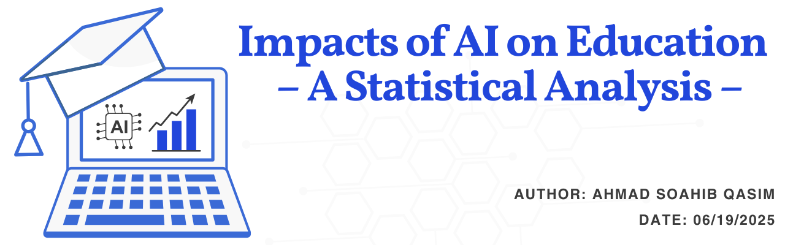
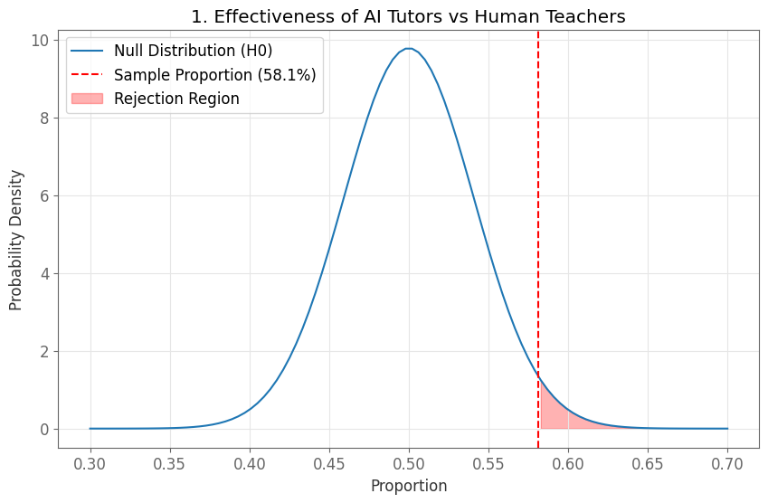
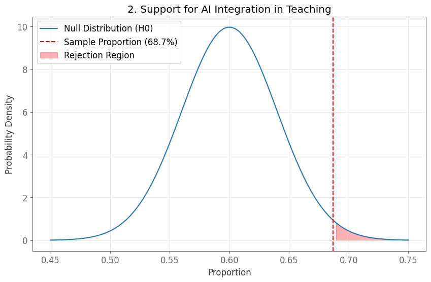
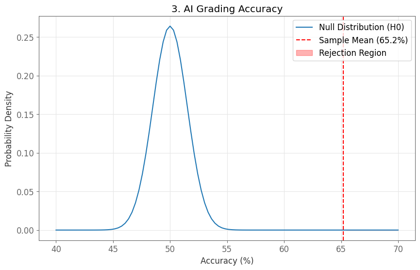
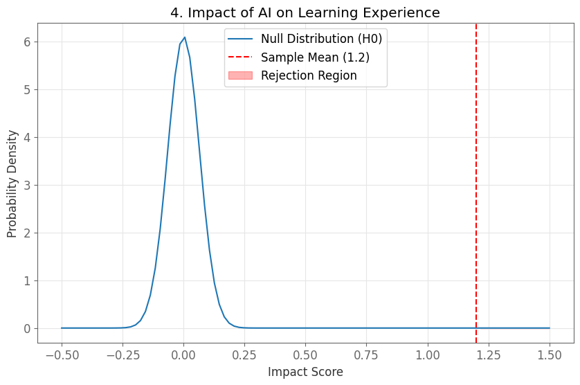
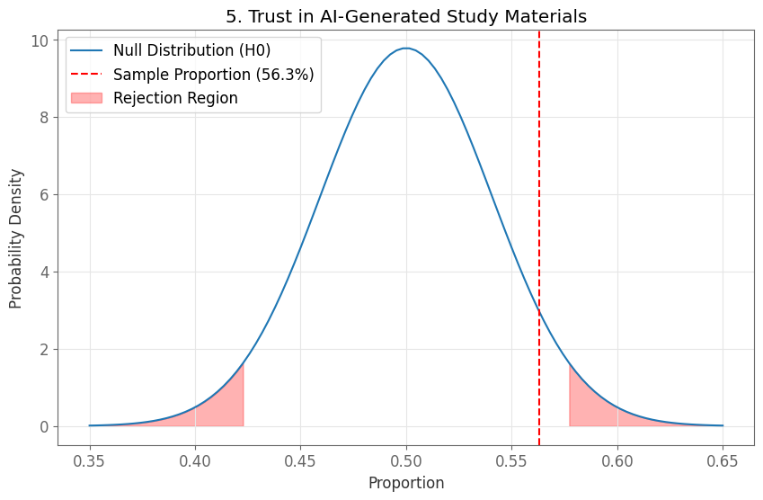
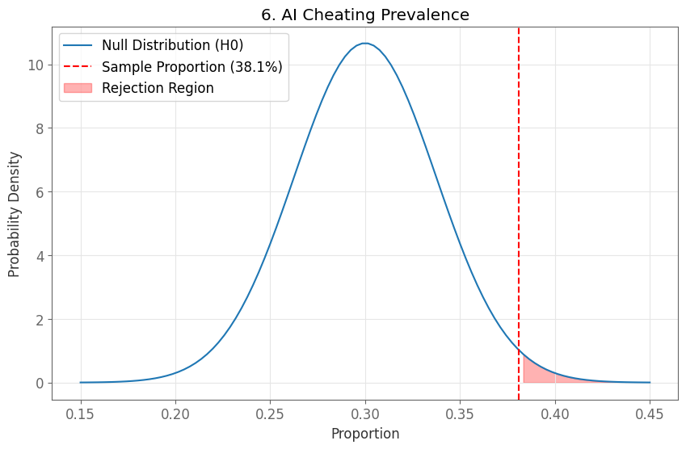
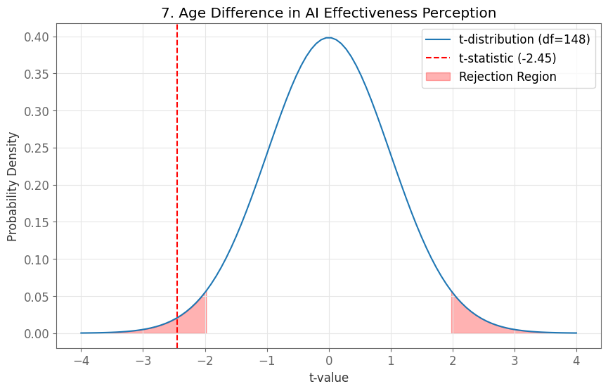
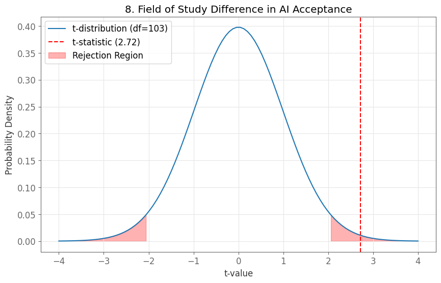

<p align="center">
  
</p>

# 🤖 AI in Education – Survey-Based Analysis

This project explores how students and teachers from various academic fields perceive the impact of Artificial Intelligence (AI) in education. Based on over **150 survey responses**, the analysis aims to uncover key differences in AI adoption attitudes across disciplines like **Medicine**, **Law**, and **Data Science**.

---

## 📊 Technologies Used

- **Python**
- `pandas` – data cleaning & manipulation  
- `numpy` – numerical operations  
- `matplotlib` – data visualization  
- `scipy` – basic statistical analysis  

---

## 📁 Project Structure

```
AI-in-Education-Analysis/
├── analysis_scripts/              
│   ├── effectiveness_ai_tutors.py
│   ├── support_ai_integration.py
│   ├── ai_grading_accuracy.py
│   ├── impact_learning_experience.py
│   ├── trust_ai_materials.py
│   ├── ai_cheating_prevalence.py
│   ├── age_difference_perception.py
│   └── field_study_difference.py
├── graphs/                       
│   ├── effectiveness_ai_tutors.png
│   ├── support_ai_integration.png
│   ├── ai_grading_accuracy.png
│   ├── impact_learning_experience.png
│   ├── trust_ai_materials.png
│   ├── ai_cheating_prevalence.png
│   ├── age_difference_perception.png
│   └── field_study_difference.png
├── responses.csv                   # Survey data file
├── README.md                       # Project documentation
└── .gitignore
```

---

## 📈 Key Insights & Visualizations

### 1. Effectiveness of AI Tutors vs Human Teachers  


### 2. Support for AI Integration in Teaching  


### 3. AI Grading Accuracy  


### 4. Impact of AI on Learning Experience  


### 5. Trust in AI-Generated Study Materials  


### 6. AI Cheating Prevalence  


### 7. Age Difference in AI Effectiveness Perception  


### 8. Field of Study Difference in AI Acceptance  


---

## 🚀 How to Run

1. Clone the repository  
2. Ensure `responses.csv` is in the root folder  
3. Run the individual scripts inside `analysis_scripts/`  
   Example:
   ```bash
   python analysis_scripts/effectiveness_ai_tutors.py
   ```

---

## 🙌 Contributing

Contributions are welcome! To contribute:

1. Fork the repository
2. Create a new branch: `git checkout -b feature-name`
3. Make your changes
4. Commit: `git commit -m "Add some feature"`
5. Push to your fork: `git push origin feature-name`
6. Open a pull request 🚀

---

## 📄 License

This project is licensed under the **MIT License** – see the [LICENSE](LICENSE) file for details.

---

## 📬 Author

**Ahmad Sohaib Qasim**  
BS Data Science, Punjab University  
[GitHub](https://github.com/as-qasim)  
[LinkedIn](https://linkedin.com/in/asqasim)
[Website](asqasim.netlify.app)
